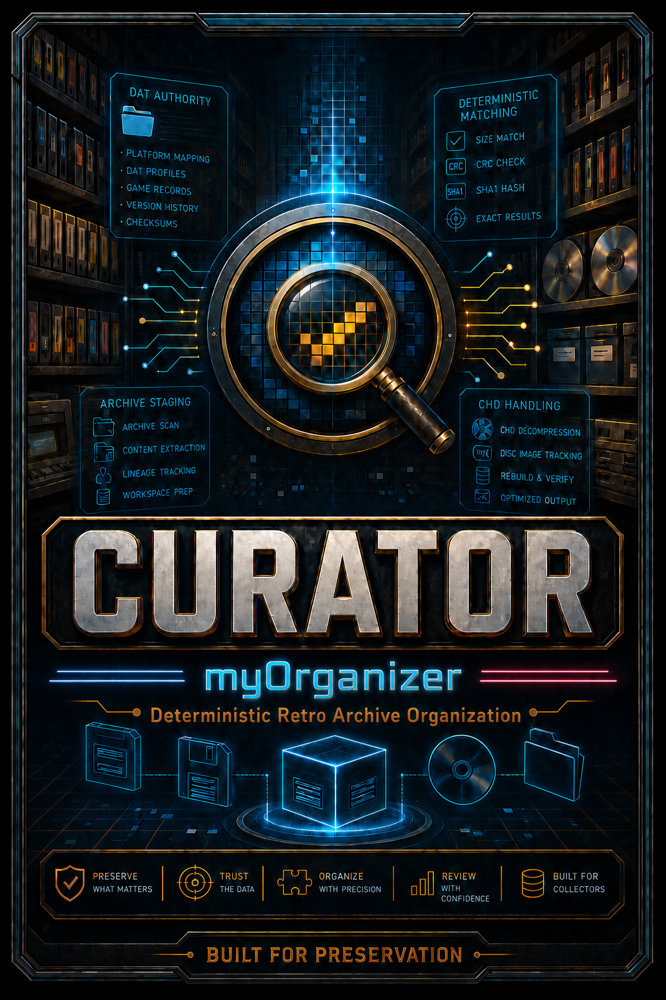

# myOrganizer: CURATOR

CURATOR is a Windows PowerShell application for analyzing, validating, reconstructing, and organizing emulation collections using DAT-based authority data.

The current public release is **CURATOR v1.0.0-beta.4**.

  

  

Artwork and branding shown here are copyright © 2026 Miguel A. Ortiz.

---

## What is CURATOR?

Starting with user-provided source files, CURATOR prepares, validates, documents, and organizes every asset using trusted preservation metadata. Unknown, incomplete, and unsupported content is identified and separated so every decision remains transparent.

The result is a clean collection with a complete audit trail, making it easy to review, maintain, and update as preservation projects continue to evolve.

---

## How CURATOR Works

### 1. Authority Preparation

Prepare preservation DATs and supporting reference metadata before any collection work begins.

  

### 2. Deterministic Matching

Evaluate every user-provided file against trusted preservation metadata to identify known content and separate unknown material.

  

### 3. LaunchBox Organization

Organize verified content into a structured, LaunchBox-ready library while preserving relationships between source material, metadata, and output.

  

### 4. Reporting & Reconciliation

Document every action so collections can be reviewed, reconciled, and maintained as preservation projects evolve.

  

---

## Current Status

CURATOR is currently available as **v1.0.0-beta.4**.

The application is a mature deterministic ten-stage pipeline. This public beta supports DAT authority processing, validation, assembly, completeness analysis, organization, durable reporting, recovery, and generated documentation.

Download the current beta and verify its published SHA-256 checksum on the
[authoritative GitHub Release](https://github.com/Jiraiya1969/myOrganizer-CURATOR/releases/tag/v1.0.0-beta.4).

Every published version remains available in the
[public release archive](https://myorganizerhq.com/releases.html). See the
[project changelog](CHANGELOG.md) for improvements, fixes, and known
limitations in each release.

---

## Free & Open Source

CURATOR is free, open-source software licensed under the
[GNU General Public License v3.0 or later](LICENSE).

CURATOR-specific warranty, liability, safety, content-responsibility,
third-party, trademark, modified-release, and support notices are provided in
the [End User License and Legal Notice](END_USER_LICENSE_AND_LEGAL_NOTICE.md).

---

## Safety Notice

CURATOR reorganizes, stages, extracts, packages, and writes files.

Always work from copies of your original data and review generated output before replacing existing collections.

---

## Contact

Questions, feedback, bug reports, and project discussions are welcome.

**Website:** https://myorganizerhq.com

**Email:** contact@myorganizerhq.com

**Repository:** https://github.com/Jiraiya1969/myOrganizer-CURATOR
